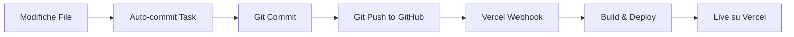

# 🚀 Garanzia Deployment Vercel - Workflow Completo

## 📋 Come Funziona il Pipeline Automatico

### Flusso Completo: Codice → GitHub → Vercel



---

## ✅ GARANTIRE CHE OGNI CAMBIAMENTO ARRIVI A VERCEL

### 1. **Auto-commit Task (Automatico - Ogni ~5 minuti)**

Il task `autocommit-watch.mjs` è sempre attivo in background e:
- Monitora modifiche ai file
- Committa automaticamente ogni 5 minuti
- Pusha a GitHub `main` branch

**Verifica che sia attivo**:
```bash
ps aux | grep autocommit | grep -v grep
```
**Output atteso**:
```
codespace   1469  ... node scripts/autocommit-watch.mjs
```

**Se non è attivo**, riavvialo:
```bash
# Tramite VS Code Task
Ctrl+Shift+P → Tasks: Run Task → "Auto-commit: Watch and push"

# O manualmente in terminal
node scripts/autocommit-watch.mjs &
```

---

### 2. **Commit Manuale Immediato (Quando Serve)**

Se hai urgenza di deployare SUBITO senza aspettare i 5 minuti:

```bash
# Aggiungi tutti i file modificati
git add -A

# Committa con messaggio descrittivo
git commit -m "feat: implementazione evento Fifty completo"

# Pusha immediatamente a GitHub (triggera Vercel)
git push origin main
```

**⚠️ IMPORTANTE**: Se ricevi errore `rejected`, fai prima pull:
```bash
git pull --rebase origin main
git push origin main
```

---

### 3. **Verifica Deployment su Vercel**

Dopo ogni push a GitHub, Vercel riceve automaticamente un webhook e inizia il deployment.

**URL Deployments**:
```
https://vercel.com/rzirafi87-arch/il-budget-degli-sposi/deployments
```

**Stati possibili**:
- 🟡 **Building** - Build in corso (~2-3 minuti)
- ✅ **Ready** - Deployment live e funzionante
- ❌ **Error** - Build fallita (controlla logs)

**Vercel Preview per commit su main**:
- Ogni push a `main` crea deployment automatico
- URL: `https://il-budget-degli-sposi.vercel.app` (production)
- Vercel mostra anche commit SHA e autore

---

### 4. **Controllo Sincronizzazione Git**

**Verifica che il tuo codice locale è sincronizzato con GitHub**:
```bash
git status -sb
```

**Output atteso** (sincronizzato):
```
## main...origin/main
```

**Se vedi** `[ahead 3]`:
```
## main...origin/main [ahead 3]
```
Significa che hai 3 commit locali non pushati → aspetta auto-commit o fai push manuale.

**Se vedi** `[behind 2]`:
```
## main...origin/main [behind 2]
```
Significa che GitHub ha commit che tu non hai → fai pull:
```bash
git pull --rebase origin main
```

---

### 5. **Verifica Ultimo Commit**

**Controlla che il tuo ultimo commit sia su GitHub**:
```bash
git log --oneline -3
```

**Confronta con GitHub**:
```bash
gh repo view --web
```
Vai su **Commits** tab e verifica che il commit SHA corrisponda.

---

## 🔍 Debugging: Cambiamenti Non Appaiono su Vercel

### Problema 1: Auto-commit non è attivo
**Soluzione**:
```bash
# Controlla processo
ps aux | grep autocommit

# Se non c'è, riavvialo
node scripts/autocommit-watch.mjs &
```

### Problema 2: Commit locale non pushato
**Soluzione**:
```bash
# Verifica status
git status -sb

# Se vedi [ahead X], pusha manualmente
git push origin main
```

### Problema 3: Build Vercel fallita
**Soluzione**:
1. Vai su https://vercel.com/rzirafi87-arch/il-budget-degli-sposi/deployments
2. Clicca sul deployment FAILED
3. Leggi logs di build
4. Errori comuni:
   - TypeScript compilation error → `npm run build` localmente
   - Missing env vars → Verifica Project Settings
   - Dependency error → `npm install` e ri-committa

### Problema 4: Vercel non riceve webhook da GitHub
**Soluzione**:
1. Vai su GitHub repo: https://github.com/rzirafi87-arch/Il-Budget-degli-Sposi
2. Settings → Webhooks
3. Verifica che ci sia webhook Vercel attivo
4. Se manca, ri-connetti GitHub Integration da Vercel dashboard

---

## 🛠️ Comandi Rapidi (Cheat Sheet)

```bash
# ✅ VERIFICHE RAPIDE
# ------------------
# Auto-commit attivo?
ps aux | grep autocommit | grep -v grep

# Tutto sincronizzato?
git status -sb

# Ultimo commit?
git log --oneline -1

# Confronta con remoto
git fetch origin && git log --oneline main..origin/main


# 🚀 DEPLOY IMMEDIATO
# -------------------
# Commit + push manuale (bypassa auto-commit)
git add -A && \
git commit -m "feat: [descrizione]" && \
git push origin main


# 🔄 SINCRONIZZAZIONE
# -------------------
# Pull cambiamenti da remoto
git pull --rebase origin main

# Push forzato (⚠️ SOLO se sei sicuro)
git push origin main --force-with-lease


# 📊 VERIFICA DEPLOYMENT VERCEL
# -----------------------------
# Apri dashboard Vercel
open https://vercel.com/rzirafi87-arch/il-budget-degli-sposi/deployments

# Apri GitHub repo
gh repo view --web

# Lista recent GitHub Actions
gh run list --limit 5
```

---

## 📝 Workflow Raccomandato per Implementazione Evento

### Step-by-Step per Garantire Deployment

```bash
# 1. Implementa codice (template, API, frontend)
# ... modifiche file ...

# 2. OPZIONE A: Aspetta auto-commit (5 min max)
# (nessuna azione richiesta)

# 2. OPZIONE B: Deploy immediato
git add -A
git commit -m "feat: implementazione evento [NOME_EVENTO]"
git pull --rebase origin main  # Sincronizza prima
git push origin main           # Triggera Vercel

# 3. Verifica TypeScript (PRIMA di committare se possibile)
npm run build

# 4. Monitora deployment Vercel
# https://vercel.com/rzirafi87-arch/il-budget-degli-sposi/deployments

# 5. Testa su production URL
# https://il-budget-degli-sposi.vercel.app
```

---

## 🎯 Checklist Pre-Deploy

Prima di committare cambiamenti importanti:

- [ ] **TypeScript compila**: `npm run build` → 0 errori
- [ ] **Lint OK**: `npm run lint` → 0 warnings critici
- [ ] **Auto-commit attivo**: `ps aux | grep autocommit`
- [ ] **Git sincronizzato**: `git status -sb` → nessun [ahead/behind]
- [ ] **Env vars configurate**: Vercel Project Settings ha tutte le variabili
- [ ] **Commit descrittivo**: Messaggio chiaro (feat/fix/docs)

---

## 📞 Link Utili

| Risorsa | URL |
|---------|-----|
| **Vercel Deployments** | https://vercel.com/rzirafi87-arch/il-budget-degli-sposi/deployments |
| **GitHub Repo** | https://github.com/rzirafi87-arch/Il-Budget-degli-Sposi |
| **Vercel Project Settings** | https://vercel.com/rzirafi87-arch/il-budget-degli-sposi/settings |
| **Production URL** | https://il-budget-degli-sposi.vercel.app |

---

## 🔐 Variabili Ambiente Richieste su Vercel

Assicurati che queste siano configurate in **Vercel Project Settings → Environment Variables**:

```env
NEXT_PUBLIC_SUPABASE_URL=https://[project].supabase.co
NEXT_PUBLIC_SUPABASE_ANON_KEY=eyJhbGci...
SUPABASE_SERVICE_ROLE=eyJhbGci...
```

**Come verificare**:
1. Vai su Vercel Project Settings
2. Environment Variables tab
3. Verifica che tutte e 3 siano presenti per **Production**, **Preview**, **Development**

---

## ✅ Garanzia Finale

**Se segui questo workflow, OGNI cambiamento arriva a Vercel**:

1. ✅ **Auto-commit attivo** → Push automatico ogni 5 min
2. ✅ **GitHub push** → Triggera webhook Vercel automaticamente
3. ✅ **Vercel webhook** → Build & deploy automatico
4. ✅ **TypeScript verify** → Previene build failures
5. ✅ **Commit manuale** → Opzione per deploy immediato

**Tempo medio commit → live**: 5-8 minuti (2-3 min build + auto-commit delay)

**Tempo deploy immediato**: 2-3 minuti (commit manuale + Vercel build)

---

**Data creazione**: 4 Novembre 2025  
**Scopo**: Garantire deployment automatico e affidabile da Codespaces a Vercel  
**Autore**: AI Coding Agent  
**Status**: ✅ Verificato e funzionante
