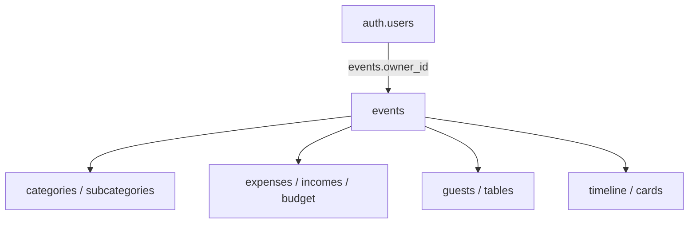

# Database Supabase

Audit aggiornato al 29 agosto 2026, Branch 25. La fonte autorevole per lo stato corrente è il catalogo PostgreSQL del progetto Supabase `Il Budget degli Sposi`; gli SQL storici nella root non sono migration canoniche e non devono essere applicati in blocco a production.

## Stato e confini

- PostgreSQL 17, schema Data API principale `public`.
- 44 tabelle `public`, 5 view `public`, 21 funzioni `public`, 27 trigger applicativi.
- RLS attivo su tutte le 44 tabelle `public`.
- Storage: nessun bucket e nessun oggetto; nessuna policy applicativa Storage.
- Realtime: nessuna tabella `public` pubblicata.
- Edge Functions: nessuna.
- Migration registrate prima del Branch 25: una (`20260828133459_secure_exposed_tables`).
- Dati rilevati: 2 utenti Auth, 10 eventi, 1 profilo.

Il backup/PITR configurato per il piano non è verificabile dagli strumenti del repository. Per questo Branch 25 non elimina tabelle, colonne, record o indici esistenti.

## Ownership utente → evento

Il modello production effettivo è owner-only:

- Un utente può possedere più eventi: non esiste unique constraint su `events.owner_id`, e un proprietario ha attualmente più eventi.
- Le tabelle private autorizzano tramite `events.owner_id`.
- Il partner opzionale viene invitato da Auth e salvato come email nell'evento, ma production non contiene `event_members`: il partner non acquisisce automaticamente accesso condiviso.
- Il codice contiene route sperimentali basate su `event_members` e share token, ma le relative tabelle non esistono in production.
- Tre eventi fanno riferimento a owner UUID non più presenti in `auth.users`. Non sono stati cancellati, riassegnati o vincolati con una nuova FK.
- Prima del Branch 25 un utente Auth non aveva una riga `profiles` e non esisteva un trigger di provisioning. Il Branch 25 introduce un'unica strategia tramite trigger Auth e inserisce soltanto i profili mancanti.

Prima di introdurre membership occorre decidere ruoli e inviti (`owner`, `editor`, `viewer`) e migrare gli owner esistenti senza sostituire l'attuale ownership.

## Mappa delle tabelle

| Tabella | Scopo e ownership | PK | Relazioni principali | Uso applicativo |
|---|---|---|---|---|
| `profiles` | Estensione privata di Auth, una riga per utente | UUID `id` | `id → auth.users` introdotta nel Branch 25 | preferenze utente e provisioning Auth |
| `events` | Evento privato, owner-only | UUID `id` | `owner_id` logico verso Auth; FK rinviata per orfani | nucleo di quasi tutte le route private |
| `categories` | Categorie per evento e categorie template | UUID `id` | `event_id → events`, `event_type_id → event_types` | dashboard, seed, budget |
| `subcategories` | Sottocategorie di budget | UUID `id` | `category_id → categories` | dashboard, spese, seed |
| `expenses` | Spese private | UUID `id` | `event_id → events` CASCADE; `subcategory_id` SET NULL | budget/dashboard |
| `incomes` | Entrate private | UUID `id` | `event_id → events` CASCADE | budget/dashboard |
| `budget_ideas` | Importi suggeriti per categoria/evento | UUID `id` | evento e categoria CASCADE; unique evento/categoria | idee budget |
| `budget_items` | Elementi budget/template; PK legacy integer | integer `id` | evento, vendor, tradition | budget e applicazione idee |
| `wedding_cards` | Dati cerimonia/ricevimento per evento | UUID `id` | evento CASCADE; church/location RESTRICT | wedding card |
| `guests` | Invitati privati | UUID `id` | evento CASCADE; gruppo famiglia SET NULL | gestione invitati/tavoli |
| `family_groups` | Nuclei familiari privati | UUID `id` | evento CASCADE; referente SET NULL | gestione invitati |
| `non_invited_recipients` | Destinatari non invitati | UUID `id` | evento CASCADE | gestione invitati |
| `tables` | Tavoli privati | UUID `id` | evento CASCADE; unique evento/numero | disposizione tavoli |
| `table_assignments` | Assegnazione univoca invitato-tavolo | UUID `id` | table e guest CASCADE | disposizione tavoli |
| `timeline_items` | Timeline privata legacy | UUID `id` | evento CASCADE | timeline baby shower e API privata |
| `user_event_timeline` | Istanze private da template timeline | UUID `id` | evento CASCADE; template SET NULL | timeline localizzata |
| `payment_reminders` | Promemoria di pagamento privati | UUID `id` | expense CASCADE | pagamenti |
| `suppliers` | Catalogo fornitore misto globale/contributo utente | UUID `id` | `user_id → auth.users` SET NULL; Google ID unique | catalogo/abbonamenti |
| `locations` | Catalogo location misto globale/contributo utente | UUID `id` | `user_id → auth.users` SET NULL; Google ID unique | catalogo/abbonamenti |
| `churches` | Catalogo chiese misto globale/contributo utente | UUID `id` | `user_id → auth.users` SET NULL; Google ID unique | catalogo/abbonamenti |
| `atelier` | Catalogo globale atelier | UUID `id` | nessuna ownership | elenco pubblico |
| `wedding_planners` | Proposte catalogo moderate | UUID `id` | `submitted_by → auth.users` | elenco pubblico/invio |
| `musica_cerimonia` | Proposte musicisti moderate | UUID `id` | `submitted_by → auth.users` | elenco pubblico/invio |
| `musica_ricevimento` | Proposte musicisti moderate | UUID `id` | `submitted_by → auth.users` | elenco pubblico/invio |
| `vendors` | Catalogo globale normalizzato e provenance | UUID `id` | `source_id` unique | sync e ricerca vendor |
| `places` | Luoghi normalizzati del catalogo vendor | UUID `id` | identificatori esterni unique | sync geografico |
| `vendor_places` | Relazione vendor-luogo | composita | vendor/place CASCADE | ricerca catalogo |
| `sync_jobs` | Stato ingestion server-only | UUID `id` | nessuna | route sync amministrative |
| `analytics_events` | Eventi analytics su cataloghi | UUID `id` | supplier/location/church CASCADE; user SET NULL | tracking server-side |
| `subscription_packages` | Piani pubblici attivi | UUID `id` | nessuna | checkout/listino |
| `subscription_transactions` | Pagamenti cataloghi | UUID `id` | supplier/location/church CASCADE | Stripe e profilo fornitore |
| `traditions` | Catalogo tradizioni | integer `id` | nessuna | contenuti pubblici |
| `checklist_modules` | Moduli template per tradizione | integer `id` | tradition | checklist pubblica |
| `event_types` | Catalogo tipi evento | UUID `id` | code unique | onboarding, dashboard, seed |
| `event_type_categories` | Categorie template per tipo | UUID `id` | event type CASCADE | seed/template |
| `event_type_subcategories` | Sottocategorie template | UUID `id` | categoria template CASCADE | seed/template |
| `event_timelines` | Timeline template | UUID `id` | event type CASCADE; unique tipo/key | timeline localizzata |
| `i18n_locales` | Locales supportate | text `code` | nessuna | i18n |
| `geo_countries` | Paesi e locale predefinito | text `code` | locale | i18n/geografia |
| `event_type_translations` | Traduzioni tipi evento | composita | event type e locale | i18n |
| `event_type_variants` | Override paese/tipo | composita | event type e paese | i18n |
| `category_translations` | Traduzioni categorie | composita | categoria e locale | i18n |
| `subcategory_translations` | Traduzioni sottocategorie | composita | sottocategoria e locale | i18n |
| `event_timeline_translations` | Traduzioni timeline | composita | timeline e locale | i18n |

## RLS e policy

- Cataloghi realmente pubblici: lettura di tipi evento, traduzioni, paesi/locales, tradizioni, cataloghi fornitori/luoghi verificati o destinati alla consultazione.
- Dati privati: `events` e tutte le tabelle dipendenti verificano l'owner dell'evento.
- Il Branch 25 rende esplicito `TO authenticated`, aggiunge `WITH CHECK` agli update sensibili e rimuove letture pubbliche da `budget_items` e `budget_ideas`.
- Le policy duplicate SELECT su guests, payment reminders e timeline vengono consolidate.
- Le proposte catalogo richiedono autenticazione, auto-attribuzione e stato pending/non verificato.
- `sync_jobs` resta senza policy client: è server-only.
- Le view pubbliche usano `security_invoker=true` e quindi rispettano RLS delle tabelle sottostanti.

## Funzioni e trigger

Le 21 funzioni `public` ricevono un `search_path` fissato a `public, pg_temp`. Le RPC che scrivono o fanno manutenzione sono revocate a `PUBLIC`, `anon` e `authenticated` e concesse esplicitamente a `service_role`. Le funzioni `SECURITY DEFINER` sono:

- `populate_event_categories()` e `populate_user_timeline()`: trigger post-insert evento;
- `set_owner_id()`: trigger pre-insert evento;
- `regenerate_event_data(uuid)` e `regenerate_event_timeline(uuid)`: manutenzione server-only.

I trigger `updated_at` sono presenti sulle tabelle applicative che espongono il campo. Branch 25 aggiunge il trigger Auth `on_auth_user_created_create_profile`, con funzione in schema `private`, per eliminare la doppia strategia/race di provisioning. Non sono emersi trigger ricorsivi.

## Foreign key e cancellazioni

- Le dipendenze strettamente interne a un evento usano prevalentemente CASCADE.
- Collegamenti opzionali usano SET NULL dove la riga figlia deve sopravvivere.
- Cataloghi e riferimenti template usano CASCADE o NO ACTION secondo la semantica esistente.
- Branch 25 aggiunge FK sicure da profilo/contributi utente ad Auth.
- La FK `events.owner_id → auth.users.id` è rinviata: tre record incompatibili richiedono una decisione esplicita e recuperabile.
- Nessun `ON UPDATE CASCADE`: gli identificatori non sono progettati per mutare.

## Indici e vincoli univoci

Sono preservati i vincoli esistenti: `events.public_id`, Google Place ID per cataloghi, `(event_id, lower(name))` per categorie, `(event_id, category_id)` per budget ideas, `(event_id, table_number)`, guest singolo per assegnazione, chiavi i18n composite e source ID vendor.

Branch 25 aggiunge soltanto indici su owner e FK usate dalle query attuali. Non rimuove i 109 indici segnalati come “unused”: il database ha pochi dati e la metrica non è sufficiente per una cancellazione. Anche il doppio indice su `timeline_items.event_id` resta candidato a una futura pulizia dopo backup verificato.

## Drift e schema riproducibile

Esiste drift rilevante:

- production ha 44 tabelle create storicamente, ma il repository registrava una sola migration di hardening;
- molti SQL nella root sono bootstrap/patch/seed storici sovrapposti, non una catena ordinata;
- il codice fa riferimento a relazioni assenti in production: `appointments`, `budgets`, `contact_messages`, `countries`, `event_members`, `event_share_tokens`, `gift_list`, `languages`, `user_favorites`, `wedding_guests`, `app_health_latest` e `v_country_event_wedding`;
- alcune route sperimentali usano anche colonne non presenti nello schema effettivo (`type_id`, `title`, `is_public`, `slug` in vari percorsi core).

Di conseguenza una nuova installazione non può ancora essere ricostruita esclusivamente dalle migration versionate. Non applicare `supabase-COMPLETE-SETUP.sql` o `supabase-ALL-PATCHES.sql` a production: contengono definizioni storiche e policy incompatibili con lo stato consolidato.

## Service role, Auth e Storage

- La service role è letta soltanto da variabili server-side e non usa prefissi `NEXT_PUBLIC_`.
- Le API con service role devono autenticare il JWT e filtrare per owner perché bypassano RLS. I test IDOR coprono le route private principali.
- Due moduli admin duplicati (`supabase-admin.ts` e `supabaseAdmin.ts`) sono candidati a consolidamento futuro; non vengono rimossi senza migrare gli import.
- Una password database era versionata in file di configurazione/documentazione. È stata rimossa, ma deve essere ruotata perché resta nella cronologia Git.
- Non essendoci bucket, policy o chiamate Storage applicative, la gestione documenti non è oggi implementata tramite Supabase Storage.

## Evoluzione per Branch 26+

Separare sempre catalogo pubblico e stato privato:

| Globale | Relazione privata wedding | Provenance minima |
|---|---|---|
| `suppliers` | `saved_suppliers` | `source`, `source_url`, `external_id`, `verified_at`, `updated_at`, `confidence` |
| `venues` (non riusare automaticamente `locations`) | `saved_venues` | stessi campi |
| `churches` | `saved_churches` | stessi campi |

Le relazioni private devono contenere `event_id`, stato pipeline, preferito, contattato, note, preventivo/costo e scelta finale, con unique `(event_id, global_entity_id)` e RLS membership-aware. Non inserire note personali nelle entità globali.

Strategia futura:

- deduplicazione: unique parziale su `(source, external_id)`, normalizzazione nome/indirizzo e revisione manuale dei match ambigui;
- geospaziale: lat/lng validati, PostGIS `geography(Point, 4326)` e GiST quando iniziano query di distanza reali;
- ricerca: colonne normalizzate, `unaccent`, `pg_trgm` per fuzzy matching e GIN full-text per nome/categoria/città;
- indici: aggiungerli dalle query reali, inclusi `(country, region, city)` e chiavi di relazione privata;
- membership: tabella evento-membro come fonte unica di autorizzazione, senza rimuovere `owner_id` durante la prima migrazione.

## Workflow migration

1. Creare una migration timestampata in `supabase/migrations`.
2. Eseguire preflight su record incompatibili e backup disponibile.
3. Applicare a un branch Supabase senza dati o a un ambiente locale equivalente.
4. Eseguire `supabase/tests/branch_25_rls.sql` e test applicativi.
5. Controllare Security/Performance Advisor e drift.
6. Applicare a production solo dopo verifica; mai modificare production manualmente fuori migration.
