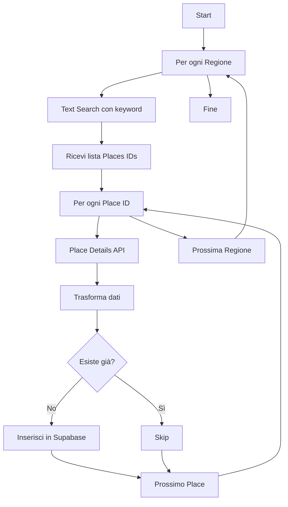

# 🗺️ Google Places API Integration

Sistema automatico per popolare il database con location reali da Google Places API.

## 📋 Setup Rapido

### 1. Ottieni una API Key di Google Places

1. Vai su [Google Cloud Console](https://console.cloud.google.com)
2. Crea un nuovo progetto (o seleziona uno esistente)
3. Abilita **Places API (New)** nel tuo progetto
4. Vai su "Credenziali" → "Crea credenziali" → "Chiave API"
5. Copia la chiave generata

### 2. Configura le variabili d'ambiente

Aggiungi al file `.env.local`:

```env
GOOGLE_PLACES_API_KEY=your_api_key_here
NEXT_PUBLIC_SUPABASE_URL=your_supabase_url
SUPABASE_SERVICE_ROLE=your_service_role_key
```

### 3. Aggiorna lo schema del database

Esegui in Supabase SQL Editor:

```bash
supabase-google-places-schema.sql
```

Questo aggiunge:
- `google_place_id` (UNIQUE)
- `google_rating` (1.0-5.0)
- `google_rating_count`
- `last_synced_at`
- Indici per performance
- Viste per statistiche

### 4. Esegui lo scraper

```bash
node scripts/scrape-google-places.mjs
```

## 🎯 Cosa fa lo script

### Discovery per Area (Sicilia, Lombardia, ecc.)

**Text Search** con parametri location-bound:
- `includedTypes`: `wedding_venue`, `banquet_hall`, `event_venue`
- `locationBias`: Cerchio con raggio 50-70km dal centro regione
- `maxResultCount`: 20 risultati per query
- `languageCode`: 'it'

**Place Details** per arricchire:
- Telefono (internazionale e nazionale)
- Sito web
- Rating e numero recensioni
- Foto
- Descrizione editoriale
- Prezzo

### Categorie supportate

#### 🏛️ Location Ricevimenti
```javascript
includedTypes: ['wedding_venue', 'banquet_hall', 'event_venue']
keywords: ['location matrimonio', 'villa matrimonio', 'castello matrimonio']
```

#### ⛪ Chiese
```javascript
includedTypes: ['place_of_worship', 'church']
keywords: ['chiesa cattolica', 'chiesa matrimonio']
```

#### 💍 Wedding Planner
```javascript
includedTypes: ['point_of_interest']
keywords: ['wedding planner', 'organizzazione matrimoni']
```

#### 🎵 Band & DJ
```javascript
includedTypes: ['point_of_interest']
keywords: ['band matrimonio', 'DJ matrimonio', 'musica matrimonio']
```

## 🔄 Flusso Completo



## 📊 Output dello Script

```
🚀 Inizio scraping location da Google Places API

📍 Regioni: 10
🔑 API Key: ✅ Configurata

🔍 Cercando locations in Lombardia...
  → Query: "location matrimonio Lombardia"
    ✅ Trovati 20 risultati
    ✨ Aggiunto: Villa Erba
    ✨ Aggiunto: Castello di Rossino
    ⏭️  Skip: Villa D'Este (già presente)
    ...

💾 Inserendo 18 location in Supabase...
✅ 18 location inserite con successo!

[...]

🎉 COMPLETATO! Totale location aggiunte: 156
```

## 🛡️ Protezioni Implementate

### Anti-Duplicati
- ✅ Controllo esistenza prima dell'inserimento
- ✅ `google_place_id` UNIQUE nel database
- ✅ Prefer header `resolution=ignore-duplicates`

### Rate Limiting
- ⏱️ 50ms tra richieste Place Details
- ⏱️ 1000ms tra regioni diverse
- 📊 Max 20 risultati per query

### Verifica Automatica
```javascript
verified: place.rating >= 4.0
```
Location con rating ≥ 4.0 sono marcate come verificate.

## 💰 Costi Google Places API

**Places API (New)** - Pricing:
- Text Search: **$32** per 1,000 richieste
- Place Details: **$0.017** per campo richiesto

**Stima per questo script:**
- 10 regioni × 3 keywords × 20 risultati = ~600 Text Search = **$19.20**
- 600 Place Details × 10 campi = **$102**
- **TOTALE: ~$121** per una scansione completa

💡 **Suggerimento**: Esegui prima su 1-2 regioni test per verificare qualità dati.

## 🔧 Personalizzazione

### Cambia le regioni
```javascript
const ITALIAN_REGIONS = [
  { name: 'Sicilia', lat: 37.5999, lng: 14.0153, radius: 70000 },
  // Aggiungi o rimuovi regioni
];
```

### Cambia i criteri di ricerca
```javascript
const SEARCH_CONFIGS = {
  locations: {
    includedTypes: ['wedding_venue', 'banquet_hall'],
    keywords: ['location matrimonio', 'villa matrimonio'],
  },
};
```

### Cambia la soglia di verifica
```javascript
verified: place.rating >= 4.5 && place.userRatingCount >= 50
```

## 📈 Query Utili Post-Import

### Location con rating più alto
```sql
SELECT * FROM high_rated_locations LIMIT 20;
```

### Statistiche per regione
```sql
SELECT * FROM location_stats_by_region;
```

### Location senza contatti
```sql
SELECT name, city, region 
FROM locations 
WHERE phone IS NULL OR website IS NULL;
```

### Location verificate vs non verificate
```sql
SELECT 
  verified,
  COUNT(*) as count,
  AVG(google_rating) as avg_rating
FROM locations
GROUP BY verified;
```

## 🚨 Troubleshooting

### Errore "API Key non valida"
- Verifica che Places API (New) sia abilitata
- Controlla che la chiave sia configurata correttamente in `.env.local`

### Errore "OVER_QUERY_LIMIT"
- Hai superato la quota gratuita ($200/mese)
- Aggiungi metodo di pagamento su Google Cloud Console

### Pochi risultati trovati
- Aumenta il `radius` nelle configurazioni regione
- Aggiungi più `keywords` specifiche
- Prova `includedTypes` diversi

### Duplicati nonostante i controlli
- Esegui `supabase-remove-duplicates.sql`
- Aggiungi il constraint UNIQUE: `ALTER TABLE locations ADD CONSTRAINT unique_location UNIQUE (name, region, city);`

## 📚 Riferimenti

- [Google Places API (New) Documentation](https://developers.google.com/maps/documentation/places/web-service/overview)
- [Place Types Reference](https://developers.google.com/maps/documentation/places/web-service/place-types)
- [Text Search API](https://developers.google.com/maps/documentation/places/web-service/text-search)
- [Place Details API](https://developers.google.com/maps/documentation/places/web-service/place-details)

## 📝 Note

- Lo script **NON** modifica location esistenti, solo aggiunge nuove
- I dati sono inseriti con `verified: true` solo se rating ≥ 4.0
- Email non è disponibile tramite Google Places API
- Capacità min/max devono essere inserite manualmente dopo

## ⚡ Prossimi Miglioramenti

- [ ] Supporto per aggiornamento automatico location esistenti
- [ ] Cron job per sincronizzazione periodica
- [ ] Estrazione automatica capacità da descrizione
- [ ] Download e hosting foto da Google Places
- [ ] Integrazione con OpenAI per arricchimento descrizioni
